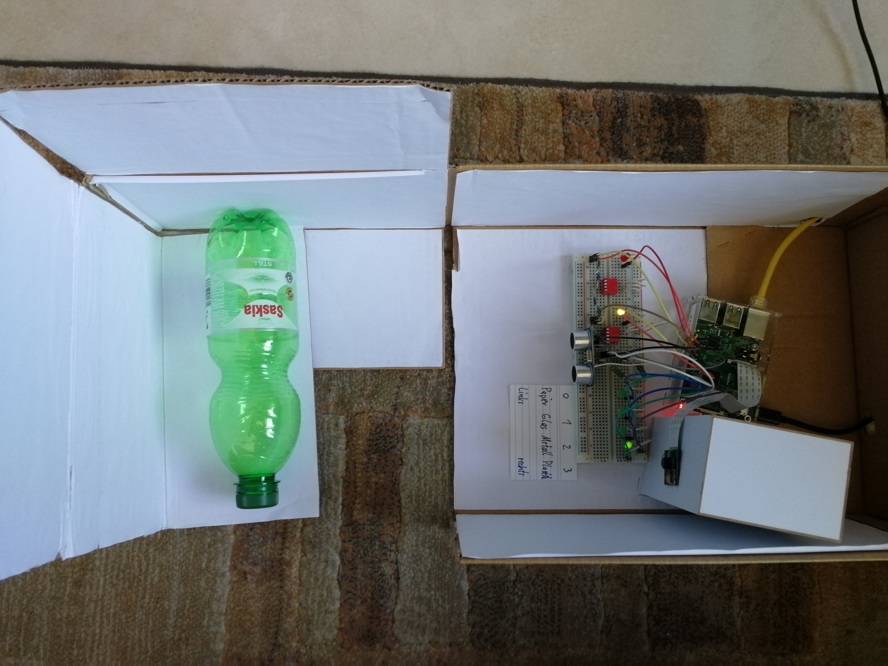

# betterrecycling
BetterRecycling uses convolutional neural networks to classify four different types of waste:
- paper
- plastic
- metal
- glass
A Raspberry Pi 1 B was used for analog classification.
This project reached the national finals (top 8) of the German National Contest for AI
([Bundeswettbewerb Künstliche Intelligenz](https://bw-ki.de)) in 2019 with over 2000 participants.
A paper, detailing all aspects of the project, is available in german.

## Dataset + Paper + Video
The data used for this project comes from multiple different sources.
Firstly, the data from [trashnet](https://github.com/garythung/trashnet) has been used,
some images have been moved into different categories or have been removed entirely.
A complete list of the changes can be found in the appendix of the paper.

Secondly an own dataset was created. Images were taken from first hand, classmates and
teachers were asked for support and some images were taken from [Wikimedia Commons](https://commons.wikimedia.org).

The final dataset consists of 5014 (2485 (trashnet) + 2529 (own)) images.
There are 1734 (702+1032) images of paper, 1332 images (784+548) of plastic, 1057 (562+495) images of glass and 891 (481+410) images of metal.

**If you are using this dataset, please give a citation of this repository. The dataset can be downloaded [here](https://drive.google.com/drive/folders/1X5u1irHtLvTFZ5pa1gszf1WhR-h_XE1x?usp=sharing).**  

If you want to use this dataset for a project, I would be very happy to know what you are up to!
I would really enjoy if you could just send a quick e-mail (see adress below) telling me about your progress,
you do not have to, obviously. It would just make me happy.
The images are resized to 224x224 pixels. If you need the images in full resolution,
please contact me directly via E-Mail: mail.borisgiba@gmail.com .
You can also find my paper, as well as a short 5 minute-video explaining the project (in german) in the same Google Drive-folder.

## Results
The primary goal of this project was to demonstrate that even smaller network architectures,
such as ones that could operate on f.e. a Raspberry Pi, could be feasible for
a classification problem of this kind.
The squeezenet-architecture was mainly chosen because of its small size and
comparatively compact architecture. The Densenet-architecture was also tested
for comparative reasons.
The architectures were pre-trained before.
Squeezenet achieved a top test-accuracy of 87,15%.
Densenet reached a test-accuracy of 91,28%.

## Images
Here is how the final analog classifier looks like:

## Using the code
If you want to take a look at the code for the neural network,
please send me a quick e-mail (mail.borisgiba@gmail.com), so I can send you the code,
it is fully commented / documented.
At the current moment I can not release the code publically, because this project will be the base
for a new task in the upcoming German National Contest for AI 2020. After that, I will probably upload the
code to this repository.
