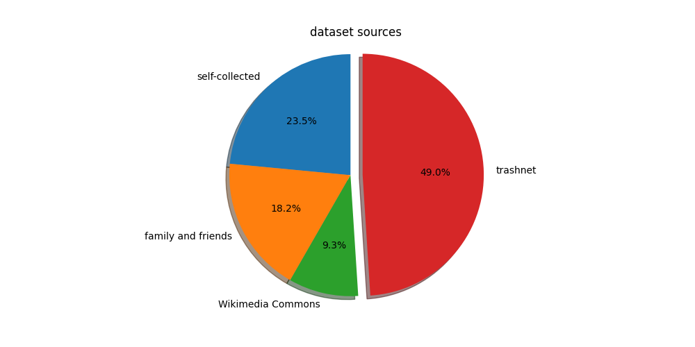
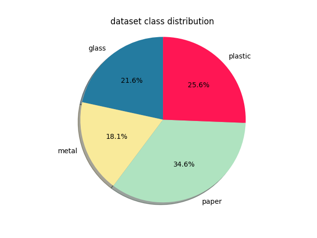
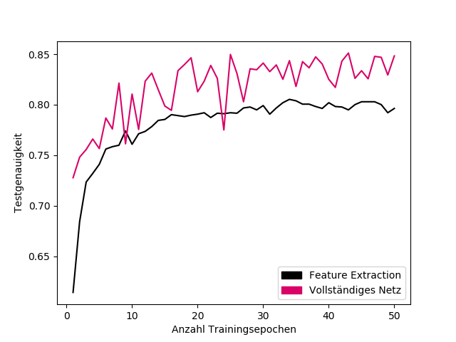

# BetterRecycling

Using convolutional neural networks in PyTorch to classify waste!

**Table of contents**
- [BetterRecycling](#betterrecycling)
  - [Recognition](#ullirecognitionliul)
  - [Idea](#idea)
  - [Dataset](#dataset)
    - [The first 50%](#the-first-50)
    - [The second 50%](#the-second-50)
    - [Using the dataset](#using-the-dataset)
  - [Classifier](#classifier)
    - [Transfer Learning](#transfer-learning)
    - [Results](#results)
  - [Using the code](#using-the-code)
  - [Documentation](#documentation)
    - [Paper](#paper)
    - [Video](#video)
  - [Recognition](#recognition)
---

## Idea
The idea is to use a CNN that classifies images of waste into four categories:
- paper
- plastic
- metal
- glass

A Raspberry Pi 1 B was used for analog classification.

Here is how the final analog classifier looks like:

Photo

 

---
## Dataset

### The first 50%
The data used for this project comes from multiple different sources.
Firstly, the data from [trashnet](https://github.com/garythung/trashnet) has been used,
some images have been moved into different categories or have been removed entirely.
A complete list of the changes can be found in *trashnet_changes.txt*.

### The second 50%
Secondly an own dataset was created. Images were taken from manually, classmates and
teachers were asked for support and some images were taken from [Wikimedia Commons](https://commons.wikimedia.org).

The final dataset consists of 5014 (2485 (trashnet) + 2529 (own)) images.
There are 1734 (702+1032) images of paper, 1332 images (784+548) of plastic, 1057 (562+495) images of glass and 891 (481+410) images of metal.

pie chart (data sources)

 

pie chart (class distribution)

 

---

### Using the dataset
**If you are using this dataset, please give a citation of this repository. The dataset can be downloaded [here](https://drive.google.com/drive/folders/1muLfvDgIZnTAHo0ACKxSCyhIpUIjbLV8?usp=sharing).**  

If you want to use this dataset for a project, I would be very happy to know what you are up to!
I would really enjoy if you could just send a quick e-mail (see adress below) telling me about your progress,
you do not have to, obviously. It would just make me happy.
The images are resized to 224x224 pixels. If you need the images in full resolution,
please contact me directly via E-Mail: mail.borisgiba@gmail.com.

---
## Classifier

### Transfer Learning
squeezenet 1.01 was used for transfer learning purposes. After initializing the network, it was trained fully, meaning no layers were frozen.
I compared both approaches and found that not freezing any layers increased the
test-accuracy. Here is the corresponding graph from the paper:

freezing layers vs not freezing layers

 

The red graph represents a network in which all layers have been trained, the black graph represents a network in which only the final layers ( called "classifier" in squeezenet) have been trained.

### Results
The primary goal of this project was to demonstrate that even smaller network architectures,
such as ones that could operate on f.e. a Raspberry Pi, could be feasible for
a classification problem of this kind.
The squeezenet-architecture was mainly chosen because of its small size and
comparatively compact architecture. The Densenet-architecture was also tested
for comparative reasons.
Squeezenet achieved a top test-accuracy of 87,15%.
Densenet reached a test-accuracy of 91,28%.

## Using the code
If you want to take a look at the code for the neural network,
please send me a quick e-mail (mail.borisgiba@gmail.com), so I can send you the code,
it is fully commented / documented.
At the current moment I can not release the code publically, because I am refractoring the entire code and creating an open source course about convolutional neural networks, where I build this entire project from scratch again, for the German National Contest for AI.

---

## Documentation
### Paper
I wrote a paper in which I explain this project in a lot more detail.
It is sadly only available in German.

### Video
I also made a video which describes the project in about 5 minutes. You can view it [here](https://www.youtube.com/watch?v=-_cfWPFxKO0), note that it is also in German.

## Recognition
This project reached the national finals (top 8) of the German National Contest for AI
([Bundeswettbewerb Künstliche Intelligenz](https://bw-ki.de)) in 2019 with over 2500 participants in total.
